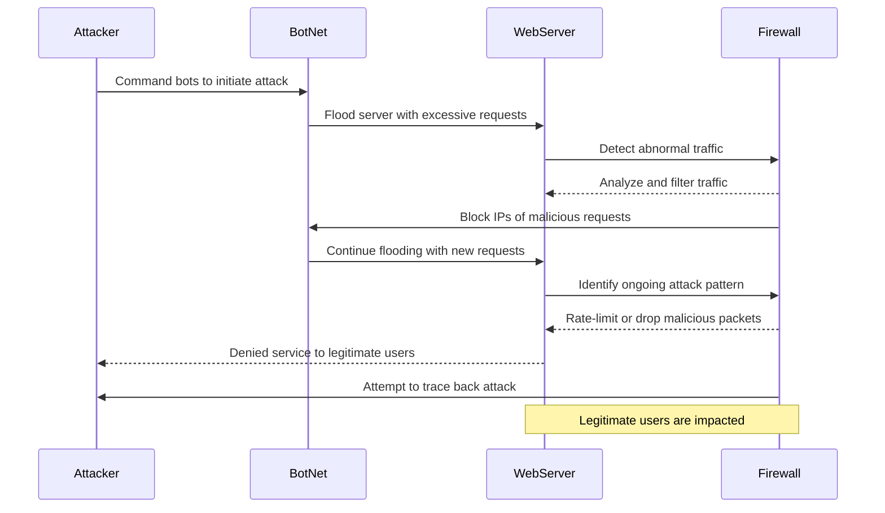

```mermaid
sequenceDiagram
    participant Attacker
    participant BotNet
    participant WebServer
    participant Firewall

    Attacker->>BotNet: Command bots to initiate attack
    BotNet->>WebServer: Flood server with excessive requests
    WebServer->>Firewall: Detect abnormal traffic
    Firewall-->>WebServer: Analyze and filter traffic
    Firewall->>BotNet: Block IPs of malicious requests
    BotNet->>WebServer: Continue flooding with new requests
    WebServer->>Firewall: Identify ongoing attack pattern
    Firewall-->>WebServer: Rate-limit or drop malicious packets
    WebServer-->>Attacker: Denied service to legitimate users
    Firewall->>Attacker: Attempt to trace back attack
    Note over WebServer,Firewall: Legitimate users are impacted
```
